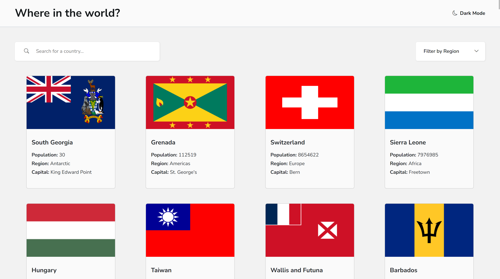
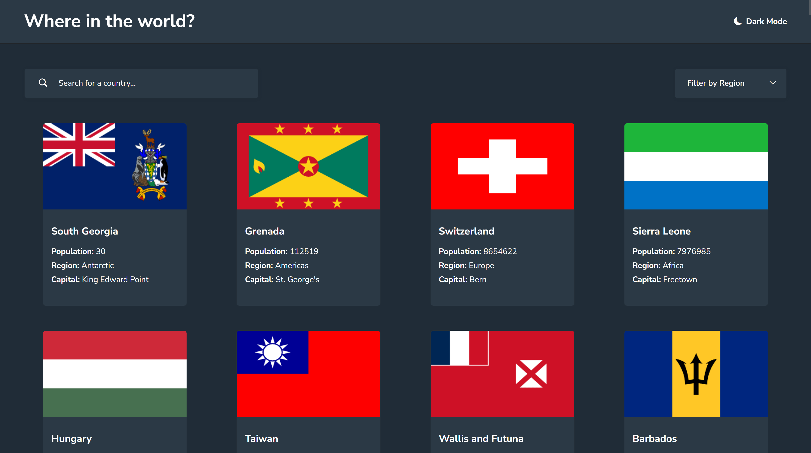
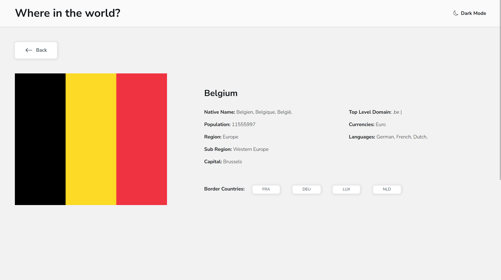
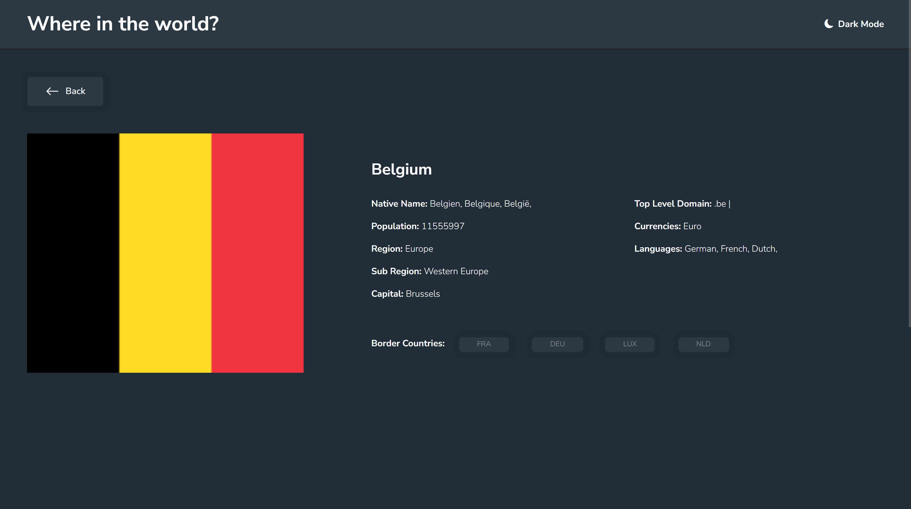
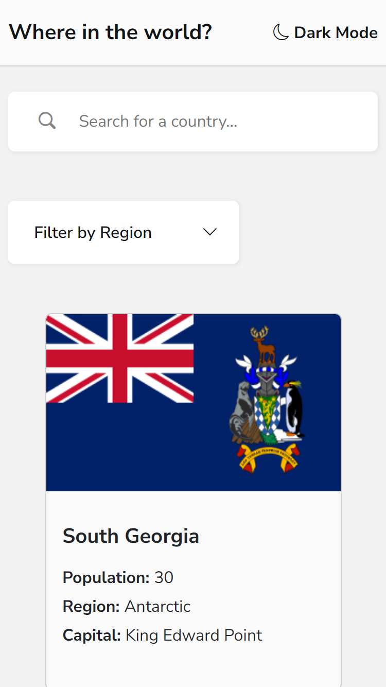
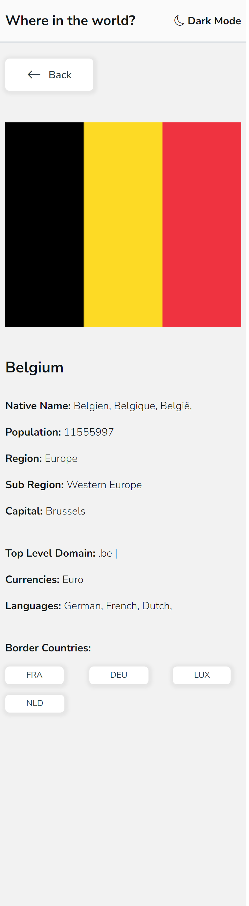

# Frontend Mentor - REST Countries API with color theme switcher - Still under development

This is a solution to the [REST Countries API with color theme switcher challenge on Frontend Mentor](https://www.frontendmentor.io/challenges/rest-countries-api-with-color-theme-switcher-5cacc469fec04111f7b848ca).  
In addition I made an ErrorPage and other layouts for the loading or error states, also I added hover effects for the elements on the pages.

## Table of contents

- [Overview](#overview)
  - [Built with](#built-with)
  - [Links](#links)
  - [Screenshot](#screenshot)

## Overview

### Built with

- HTML
- CSS custom properties
- TypeScript
- [Bootstrap](https://getbootstrap.com/)
- [React](https://reactjs.org/)
- [React Router](https://reactrouter.com/en/main)
- [Rest Countries API](https://restcountries.com/#about-this-project-important-information)

### Links

- Live Site URL:

### Screenshot

